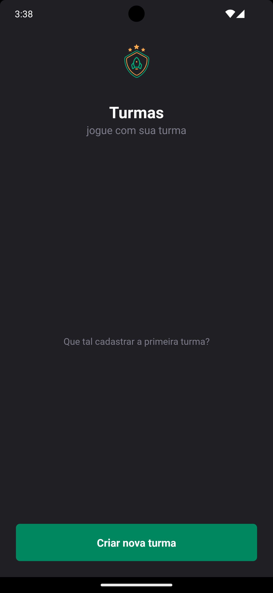
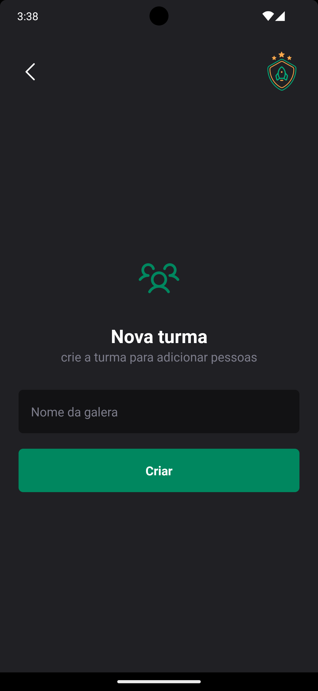
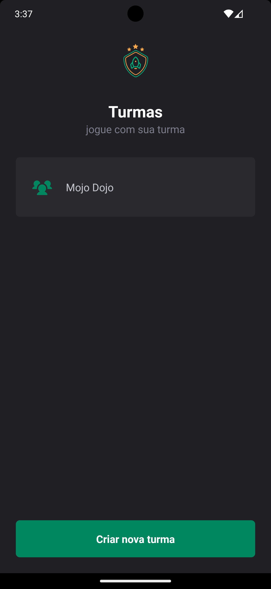
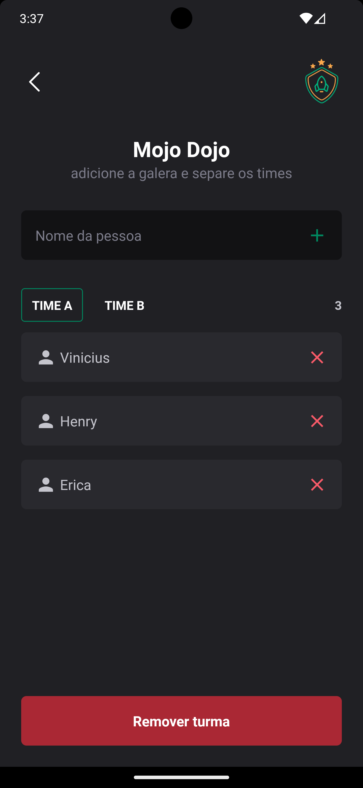
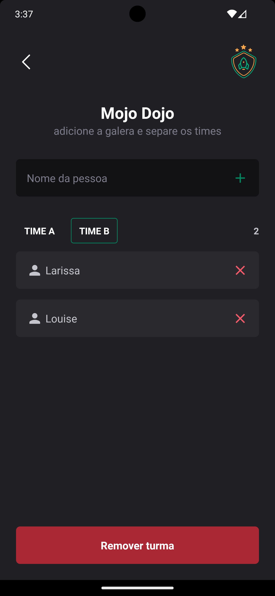
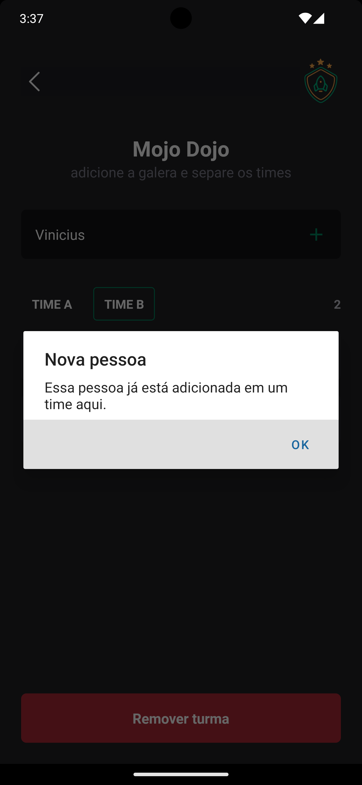
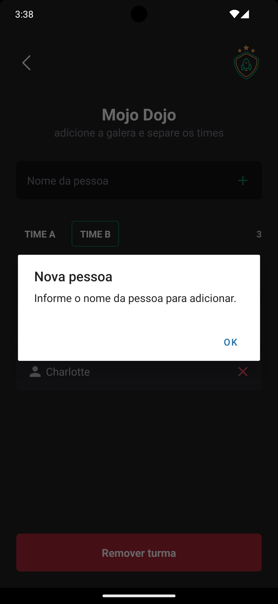
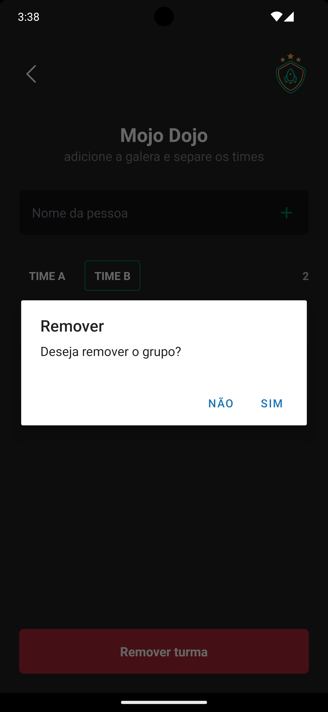

<h1 align="center">
  
</h1>

<br />

<h3 align="center">
  About Challenge
</h3>

In this challenge, I developed an application for help to manage people that playing together in groups. It's an app with stack navigation, is possible register/remove groups ands members of teams and save data in local storage. 
I follow a styled guide.

- [ ] 

I need to apply concepts like: 

- Path Mapping
- How to avoid Prop Drilling (I already write an article in [Medium](https://medium.com/@soutovnc/props-drilling-in-react-react-native-4c0a6f2fe144))
- Navigation with Stack Navigator
- Local Storage with AsyncStorage

<h3 align="center">
  Tech's
</h3>

- [expo]()
- [Styled Components](https://styled-components.com/)
- [AsyncStorage]()
- [TypeScript](https://www.typescriptlang.org)
- [Phosphor](https://www.phosphoricons.com/)

<p align="center">
  
  
  
</p>

<p align="center">
  
  
</p>

<p align="center">
  
  
  
</p>
 
## :gear: | If you want to test

```bash
### after clone repo, install the dependencies
$ npm i

### running application
$ npm run start

### If you can use a emulator, write "a" in terminal to run android emulator
### or use your device and scan the QRcode on terminal
```
See you later, bye 👋🏻!

Developed with ❤️ by [Vinicius de Souto](https://github.com/soutovnc)
